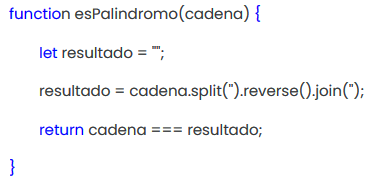

# Actividad en clase: Caso Palíndromos - Pruebas Unitarias
## Caso: Palíndromos - somordnílaP :osaC

#### Paso 1: Leer y entender el contexto problema. (15 mins.)

**1.1 Discutir y concluir:**
* Código Javascript:

***¿Qué hace el método?***

El método recibe un **_String_**, le quita los espacios y lo da vuelta. Posteriormente retorna _**true**_ si el **_String_** en reversa es igual al **_String_** original, sino retorna **_false_**.

***¿Cómo lo hace?***

Se realiza utilizando los métodos **_split()_**, **_reverse()_** y **_join()_**, además de una variable local _resultado_ que almacena el **_String_** en reversa.

***¿Cómo lo uso?***

El uso del método sólo requiere un **_String_** como parámetro, luego devuelve un **_booleano_**.

Un ejemplo de uso es, pasarle el **_String_** _"palabra"_: 

1. Se crea la variable _resultado_ que almacena un **_String_** vacío _""_

2. **_split("")_** convierte el parámetro de entrada en un arreglo de la forma`["p", "a", "l", "a", "b", "r", "a"]`

3. **_reverse()_** invierte el arreglo,`["a", "r", "b", "a", "l", "a", "p"]`

4. **_join("")_** junta todos los elementos del arreglo en un **_String_** _"arbalap"_

5. Se guarda el **_String_** en la variable _resultado_

6. Finalmente, se devuelve **_true_** o **_false_**, si es que el parámetro ingresado es igual a la cadena invertida. En este caso **_false_**.

#### Paso 2: Entender el método JavaScript (15 mins.)

**2.2 Construya en grupo ahora una versión Java que sea 100% equivalente en funcionalidad (lo bueno y lo malo) al anterior método.**

Version 100% equivalente se encuentra en el repositorio, **_PalindromoOld.java_**

#### Paso 3: Ok! Si el método funciona ¿Qué puede malir sal? ;-) (15 mins.)

**3.1 Discutir en grupo el diseño de un plan de pruebas para este caso.**

El método puede fallar si el String recibido contiene mayúsculas y minúsculas, números, carácteres especiales, etc.

**3.2 A partir de su plan de pruebas, diseñe los casos de pruebas unitarias a implementar (aún no codifique nada!!!), considere al menos 5.**

Considerando que aún se mantiene el código original; 

1. Probar que si se entrega un String vacio como parámetro, el método esPalindromo() retorne falso.
2. Probar que si se entrega una palabra que es palíndromo, el método esPalindromo() retorne verdadero.
3. Probar que si se entrega una palabra que no es palíndromo, el método esPalindromo() retorne falso.
4. Similar a 3 y 4, pero probar con una oración(contiene espacios).
5. Probar si el método quita los espacios.

**3.4 ¿Qué resultados arrojan sus Test con estas entradas: “aca”, “acas”, “h”?**

Paso la prueba, no la pasó y no la pasó, respectivamente.

**4.1 Considere los siguientes casos de prueba, no codifique NADA, discuta en su grupo.**

- Caso de prueba 1:

***Input: 200 (número entero)***

Output: Debería dar error.

- Caso de prueba 2:

***Input: “” (cadena vacía)***

Output: Falso, no es palíndromo.

- Caso de prueba 3:

***Input: “aaabccbaaa”***

Output: Verdadero, es palíndromo.

- Caso de prueba 4:

***Input: “ahabccbaaa”***

Output: Falso, no es palíndromo.

- Caso de prueba 5:

***Input: “La tele letal”***

Output: En este caso es falso, ya que el código no considera las mayúsculas y minúsculas como iguales.

**4.2 De las pruebas analizadas, concluya y construya una versión mejorada de su método. Construya además nuevas pruebas unitarias considerando los casos anteriores y verifique sus resultados teóricos con los empíricos.**

***¿Qué consideraciones tomaron en cuenta?***

Tomamos en cuenta que el input puede tener mayúsculas, minúsculas, espacios, saltos de linea, numeros, tildes, signos de puntuación, etc. Se crearon métodos para formatear el input y que así el programa funcione para cualquier input.

***¿Qué mejoró en su método?***

El método ahora funciona para mas situaciones, ya que tiene en consideración lo anterior.

***¿Qué rol jugaron las pruebas en mejorar su código?***

Las pruebas, además de comprobar que el método funcionara eficazmente, ayudaron a la creación de los métodos, ya que en ocasiones guiaban a nuevos fallos los cuales se solucionaban a través de nuevos métodos.

==========================
